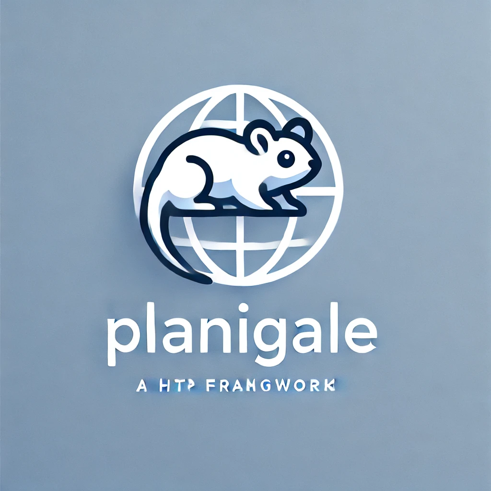

<p align="center">
  
</p>

# Planigale

> [!CAUTION]
> This project is under heavy development and is not ready for production use.
> Please, do not use it yet.


## Description

Minimalistic HTTP framework for Deno

## Usage

### Deno
Planigale is available on both deno.land/x and JSR.
For deno.land/x use the following import:
```typescript
import { Planigale } from "https://deno.land/x/planigale/mod.ts";
```
For JSR use the following import:
```typescript
import { Planigale } from "jsr:@codecat/planigale";
```
or add it to your import maps:
```bash
deno add @codecat/planigale
```

### NPM

Planigale is also available on NPM. To use it, you need to install it first:
```bash
npm install planigale
```
Then you can import it in your project:
```typescript
import { Planigale } from "planigale";
```


### Basic example

```typescript
import { Planigale } from "@codecat/planigale";

const app = new Planigale();

// Simple logging middleware
app.use(async (req, res) => {
    const ts = new Date().toISOString();
    const log = ts+ ": "+ req.method + " " + req.url;
    console.time(log);
    await req.next();
    console.timeEnd(log);
});


app.route({
  method: "GET",
  url: "/users/:id",
  handler: async (req, res) => {
    const id = req.params.id;
    res.send({ id });
  },
})

app.serve({port: 8000});
```

### Defining routes

Routes are meant to produce a response to a particular request. They are defined by the `route` method of the app object. The method takes an object with the following properties:
```typescript
{
  method: string,
  url: string,
  description?: string,
  tags?: string[],
  schema?: object,
  handler: (req: Request, res: Response) => void,
}
```


**Validation support**

Planigale supports validation of request body and query parameters using ajv library. ajv is not native to Deno, so this can change in the future.
For validation json schema is used. 

```typescript


app.route({
  method: "GET",
  url: "/users/:id",
  schema: {
    params: {
      type: "object",
      required: ["id"],
      properties: {
        id: { type: "number" },
      },
    },
    headers: {
      type: "object",
      required: ["authorization"],
      properties: {
        authorization: { type: "string", pattern: "Bearer .+" },
      },
    }
  },
  handler: async (req, res) => {
    const id = req.params.id;
    res.send({ id });
  },
})

const request: Request = new Request("http://localhost:3000/users/invalid_id", {
  method: "GET",
  headers: {
    authorization: "invalid_token",
  },
});

const response: Response = await app.handle(request);

assertEquals(response.status, 400);
assertEquals(await response.json(), [
    {
      block: "params",
      instancePath: "/id",
      keyword: "type",
      message: "must be number",
      params: {
        type: "number",
      },
      schemaPath: "#/properties/id/type",
    },
    {
      block: "headers",
      instancePath: "/authorization",
      keyword: "pattern",
      message: 'must match pattern "[Bb]earer .*"',
      params: {
        pattern: "[Bb]earer .*",
      },
      schemaPath: "#/properties/authorization/pattern",
    }
]);
```


### Middleware

Middleware is a function that has access to the request object, the response object, and the next middleware function in the application’s request-response cycle. The next middleware function is commonly denoted by a variable named next.


```typescript
app.use(async (req, res, next) => {
    console.log("Before");
    await next();
    console.log("After");
});

## Automatic docs generation

Planigale can generate OpenAPI 3.0 documentation for your API. Just add `docs` method to your app and visit `/docs` endpoint.

```typescript
app.docs('/docs', { enabled: Deno.env.get("LOCAL_ENV") === "true" })
```

## Injecting dependencies

TBA


## Testing

### Unit testing
Planigale is designed to be easily testable. You can test your handlers without running the server.
```typescript
import { Planigale } from "@codecat/planigale";
import { assertEquals } from "https://deno.land/std/testing/asserts.ts";

const app = new Planigale();

const route = app.route({
  method: "GET",
  url: "/users/:id",
  handler: async (req, res) => {
    const id = req.params.id;
    const id = req.state.user.name;
    res.send({ id, name });
  },
})

Deno.test("Chaking endpoints output", async () => {
    const req = new Req("/users/1", {method: "GET", state: {user: {name: "John"}}});
    const res = new Res();
    await route.handler(req, res);
    assertEquals(res.status, 200);
    assertEquals(res.body, { id: "1", name: "john" });
})
    
```
### Module testing
Whole app can be easlily tested using just one function that take Request object as an argument and return Response object.

```typescript

import { Planigale } from "https://deno.land/x/planigale/mod.ts";
import { assertEquals } from "https://deno.land/std/testing/asserts.ts";

const app = new Planigale();

app.route({
  method: "GET",
  url: "/users/:id",
  handler: async (req, res) => {
    const id = req.params.id;
    res.send({ id });
  },
})


Deno.test("Chaking endpoints output", async () => {
    const request: Request = new Request("http://localhost:3000/users/1", {
      method: "GET",
    });

    const response: Response = await app.handle(request);

    assertEquals(response.status, 200);
    assertEquals(await response.json(), { id: "1" });
})

```

### Integration testing

```typescript
Deno.test("Chaking full app", async (t) => {
    const app = new Planigale();

    app.route({
      method: "GET",
      url: "/users/:id",
      handler: async (req, res) => {
        const id = req.params.id;
        res.send({ id });
      },
    })

    t.step("start up", async () => {
        await app.serve(3000);
    });

    t.step("GET /users/1", async () => {
        const request: Request = new Request("http://localhost:3000/users/1", {
          method: "GET",
        });

        const response: Response = await fetch(request);

        assertEquals(response.status, 200);
        assertEquals(await response.json(), { id: "1" });
    });

    t.step("tear down", async () => {
        await app.close();
    });
})

```


